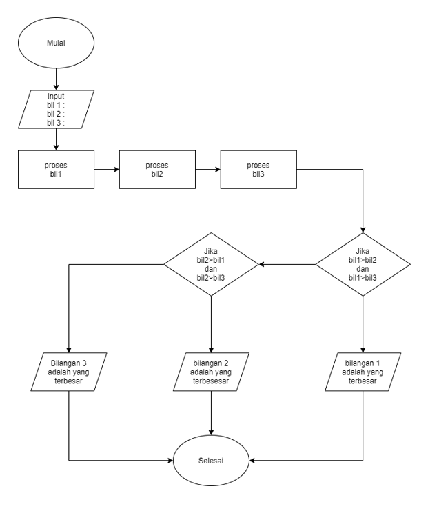
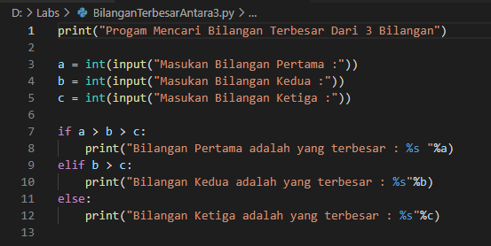
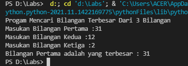
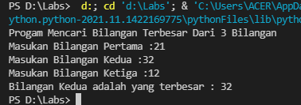
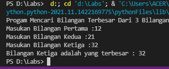

# labspy02
## Program Menentukan Bilangan Terbesar di Antara 3 Bilangan

### Berikut Contoh Bentuk Flowchart

Dengan Memasukan 3 Angka Program akan membandingkan di antara 3 bilangan tersebut lalu memberikan hasil di antara ke 3 bilangan
### Berikut Contoh Code Program

### Berikut Contoh Ketika Angka Pertama yang Terbesar

### Berikut Contoh Ketika Angka  yang Terbesar

### Berikut Contoh Ketika Angka  yang Terbesar
